> **Impact:** Built a production-grade finance analytics pipeline ingesting real-time market data from Yahoo Finance via Kafka into Snowflake's Medallion Architecture (Bronze -> Silver -> Gold). Delivered 12 dbt incremental models with 19 data quality tests, NLP sentiment analysis on 56+ news articles, and 11 executive-ready analytical dashboards — all orchestrated with Airflow DAGs.

# Finance Data Analytics Pipeline

An end-to-end finance data analytics platform that ingests real-time and batch market data from Yahoo Finance, processes it through a **Medallion Architecture** in **Snowflake**, and generates insightful visualizations. The project showcases modern data engineering practices including streaming with **Kafka**, transformations with **dbt**, orchestration with **Airflow**, and NLP-based sentiment analysis on financial news.

---

## Architecture Overview

```
Yahoo Finance API
       |
       v
+------+---------+        +------------------+
| Batch Ingestion |        | Real-Time Stream |
| (Python/yfinance)|       | (Kafka Producer) |
+------+---------+        +--------+---------+
       |                            |
       v                            v
+------+----------------------------+---------+
|              SNOWFLAKE (FINANCE_DB)          |
|                                              |
|  +--------+    +--------+    +------+        |
|  | BRONZE |===>| SILVER |===>| GOLD |        |
|  | (Raw)  |    |(Clean) |    |(Agg) |        |
|  +--------+    +--------+    +------+        |
|       ^             ^             |          |
|       |             |             v          |
|   Snowpipe      dbt Models    DATA MARTS     |
|   + Streams                   (6 Views)      |
+----------------------------------------------+
       |
       v
+------+----------------------------+
| Python Analysis & Visualizations  |
| (11 Charts + Matplotlib/Seaborn)  |
+-----------------------------------+
       |
       v
  Airflow DAGs (Scheduling)
```

---

## Key Features

- **Medallion Architecture** - Bronze (raw) -> Silver (cleansed/enriched) -> Gold (aggregated) -> Marts (analytics views)
- **Real-Time Streaming** - Apache Kafka producer/consumer for live stock, crypto, and forex data
- **dbt Transformations** - 12 incremental models with 19 data quality tests
- **NLP Sentiment Analysis** - TextBlob-based sentiment scoring on financial news (unstructured data)
- **Automated Orchestration** - Apache Airflow DAGs for daily and weekly pipeline scheduling
- **Snowpipe & CDC Streams** - Auto-ingest and Change Data Capture for near real-time updates
- **Comprehensive Visualizations** - 11 publication-ready analytical charts

---

## Demo & Screenshots

### Executive Dashboard
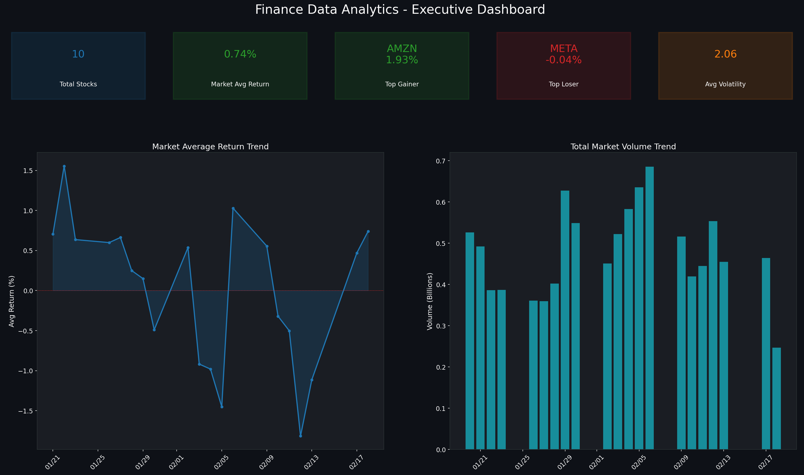

### Stock Price Trends & Risk Analysis
| Stock Trends | Risk vs Return |
|:---:|:---:|
| 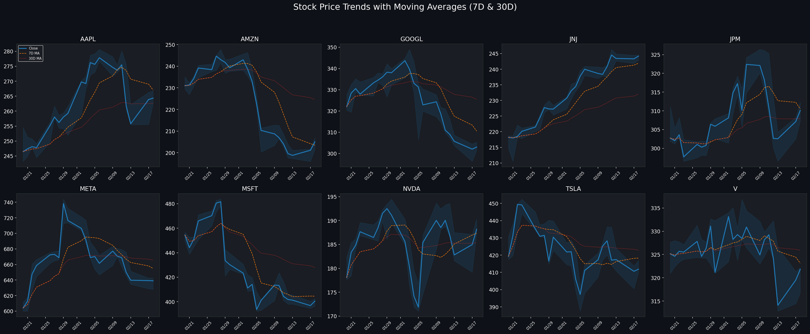 | 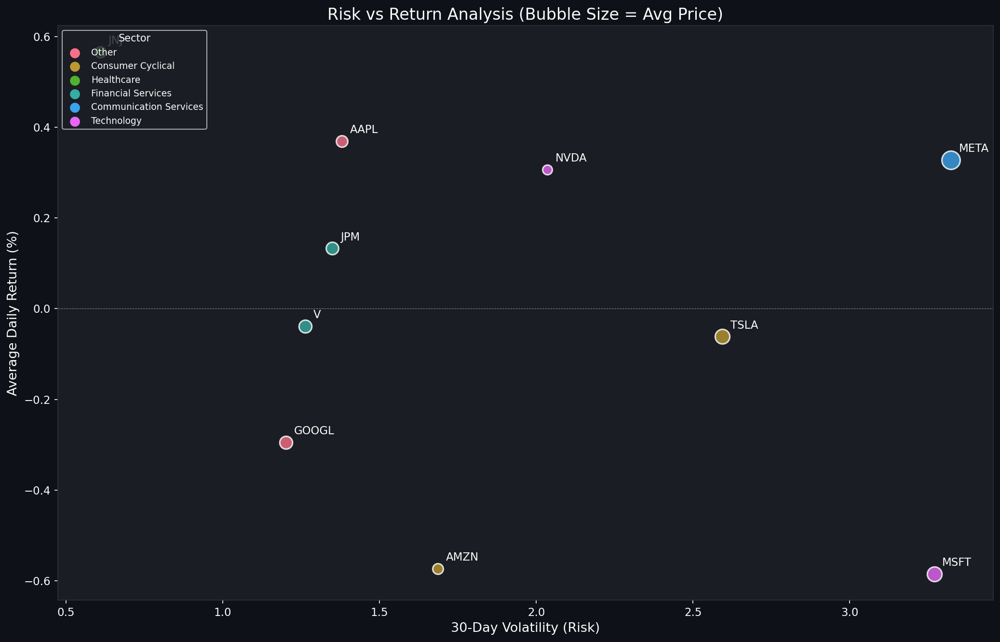 |

### Crypto & Sentiment Analysis
| Crypto Dashboard | News Sentiment |
|:---:|:---:|
| 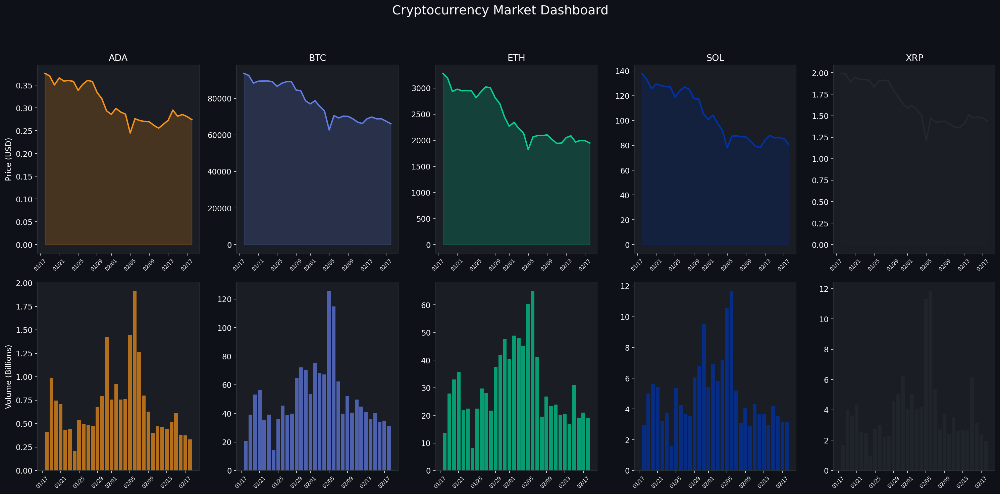 | 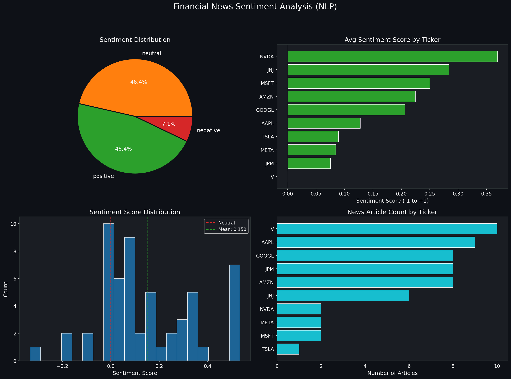 |

---

## Tech Stack

| Component | Technology |
|-----------|-----------|
| **Cloud Data Warehouse** | Snowflake |
| **Data Ingestion** | Python, yfinance API |
| **Streaming** | Apache Kafka (Confluent), Docker |
| **Transformations** | dbt (data build tool) |
| **Orchestration** | Apache Airflow |
| **NLP / Unstructured** | TextBlob, NLTK |
| **Visualization** | Matplotlib, Seaborn, Pandas |
| **Containerization** | Docker Compose |
| **Language** | Python 3.11, SQL (Snowflake SQL) |

---

## Project Structure

```
finance-data-analytics/
|
|-- snowflake/                    # Snowflake DDL & setup scripts
|   |-- 001_setup_database.sql    # Warehouse, database, schemas, Bronze tables
|   |-- 002_snowpipe_setup.sql    # File formats, stages, Snowpipes
|   |-- 003_silver_layer.sql      # Silver layer table definitions
|   |-- 004_gold_layer.sql        # Gold layer aggregated tables
|   |-- 005_data_marts.sql        # 6 analytical mart views
|
|-- ingestion/                    # Batch data ingestion
|   |-- yahoo_finance_ingestion.py  # Stock, crypto, forex, fundamentals, news
|
|-- kafka/                        # Real-time streaming
|   |-- producers/
|   |   |-- stock_price_producer.py  # Streams live prices to Kafka topics
|   |-- consumers/
|   |   |-- snowflake_consumer.py    # Consumes Kafka -> Snowflake Bronze
|
|-- dbt/finance_analytics/        # dbt transformation project
|   |-- models/
|   |   |-- staging/              # 4 staging views + source definitions
|   |   |-- silver/               # 3 incremental models (stocks, crypto, forex)
|   |   |-- gold/                 # 3 aggregation models (summaries, sentiment)
|   |   |-- marts/                # 2 mart models (portfolio, executive)
|   |-- dbt_project.yml
|   |-- profiles.yml
|
|-- unstructured/                 # NLP processing
|   |-- news_sentiment_processor.py  # Sentiment analysis on financial news
|
|-- airflow/                      # Workflow orchestration
|   |-- dags/
|   |   |-- finance_data_pipeline.py  # Daily + weekly scheduled DAGs
|
|-- analysis/                     # Python analytics & visualization
|   |-- finance_analysis.py       # 11 chart generation functions
|
|-- images/                       # Generated visualization outputs
|   |-- 01_stock_price_trends.png
|   |-- 02_daily_returns_heatmap.png
|   |-- ...
|   |-- 11_correlation_matrix.png
|
|-- config/                       # Configuration helpers
|   |-- snowflake_config.py       # Snowflake connection utility
|
|-- scripts/                      # Utility scripts
|   |-- setup_snowflake.py        # One-time Snowflake DDL executor
|   |-- run_full_pipeline.py      # End-to-end pipeline runner
|
|-- docker-compose.yml            # Kafka + Zookeeper + Kafka UI
|-- requirements.txt              # Python dependencies
|-- .env                          # Environment variables (not committed)
|-- README.md
```

---

## Data Sources

| Source | Assets | Records |
|--------|--------|---------|
| **Stocks** | AAPL, MSFT, GOOGL, AMZN, TSLA, META, NVDA, JPM, V, JNJ | 210 |
| **Crypto** | BTC-USD, ETH-USD, SOL-USD, ADA-USD, XRP-USD | 160 |
| **Forex** | EUR/USD, GBP/USD, JPY/USD, AUD/USD | 92 |
| **Fundamentals** | Company profiles & financial statements | 32 |
| **News** | Financial news articles with NLP sentiment | 56 |
| **Total** | Across all Snowflake layers | **1,642** |

---

## Medallion Architecture

### Bronze Layer (Raw)
Raw data ingested directly from Yahoo Finance API via Python scripts and Kafka consumers. Six Bronze tables with CDC streams for change tracking.

| Table | Description |
|-------|-------------|
| `RAW_STOCK_PRICES` | Daily OHLCV stock price data |
| `RAW_CRYPTO_PRICES` | Cryptocurrency price and volume data |
| `RAW_FOREX_RATES` | Foreign exchange rate pairs |
| `RAW_COMPANY_FUNDAMENTALS` | Company financial profiles |
| `RAW_FINANCIAL_NEWS` | Raw news articles and metadata |
| `RAW_ECONOMIC_INDICATORS` | Macro-economic indicator data |

### Silver Layer (Cleansed & Enriched)
Data cleansing, deduplication, and technical indicator computation via dbt incremental models.

- **Technical Indicators**: 7-day & 30-day moving averages, 30-day volatility, daily returns
- **Sentiment Enrichment**: TextBlob polarity & subjectivity scores, entity extraction
- **Data Quality**: 19 dbt tests (not_null, unique, accepted_values, relationships)

### Gold Layer (Aggregated)
Business-level aggregations optimized for analytics consumption.

| Table | Description |
|-------|-------------|
| `GOLD_STOCK_DAILY_SUMMARY` | Stock summaries with sector and volume metrics |
| `GOLD_SECTOR_PERFORMANCE` | Sector-level return and volatility analysis |
| `GOLD_NEWS_SENTIMENT_DAILY` | Daily aggregated news sentiment scores |

### Data Marts (Analytics Views)
Six pre-built analytical views for direct consumption:

- `VW_PORTFOLIO_PERFORMANCE` - Portfolio-level stock analytics
- `VW_CRYPTO_MARKET` - Cryptocurrency market overview
- `VW_FOREX_OVERVIEW` - Forex rate trends and changes
- `VW_SECTOR_ANALYSIS` - Sector comparison analytics
- `VW_NEWS_SENTIMENT` - Sentiment trend analysis
- `VW_EXECUTIVE_SUMMARY` - High-level KPI dashboard

---

## Visualizations

### 1. Stock Price Trends


### 2. Daily Returns Heatmap
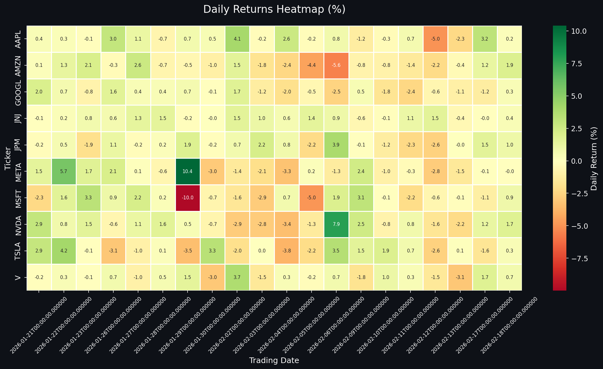

### 3. Sector Performance
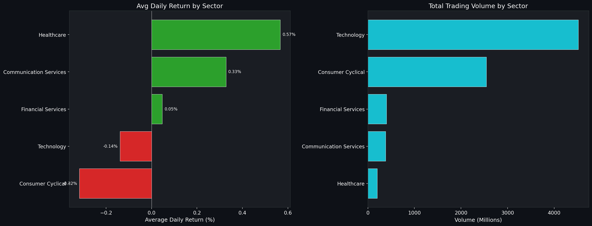

### 4. Crypto Dashboard


### 5. Forex Rates
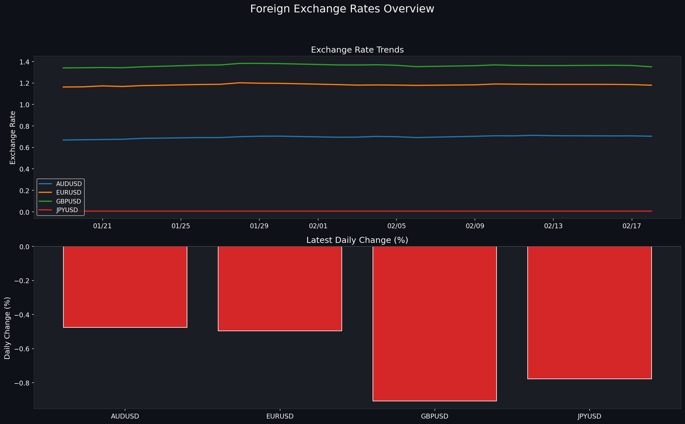

### 6. News Sentiment Analysis


### 7. Risk vs Return


### 8. Volume Analysis
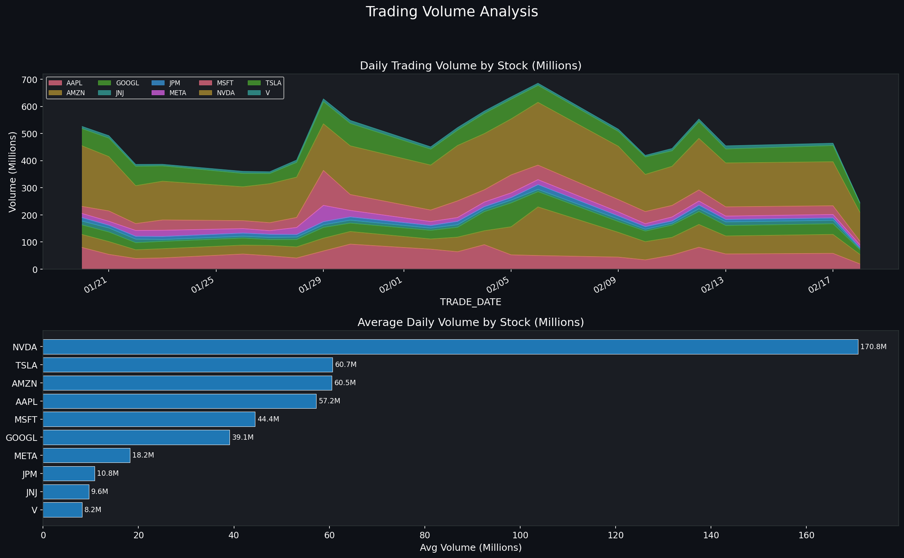

### 9. Cumulative Returns
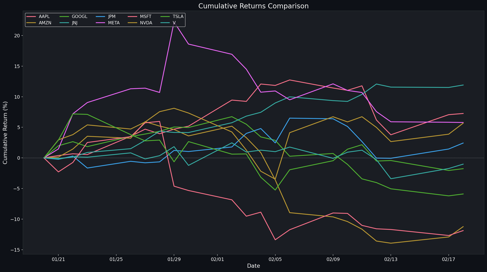

### 10. Executive Dashboard


### 11. Correlation Matrix
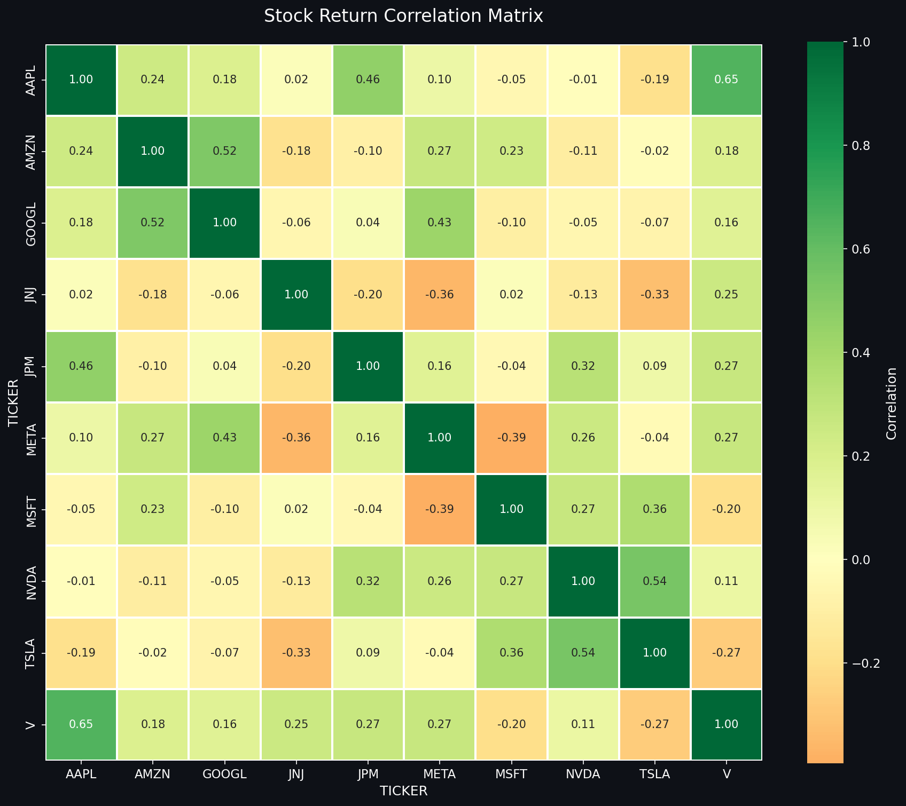

---

## dbt Lineage

```
Sources (Bronze)
  |-- stg_stock_prices (staging view)
  |     |-- silver_stock_prices (incremental)
  |           |-- gold_stock_daily_summary (table)
  |           |-- gold_sector_performance (table)
  |           |     |-- mart_portfolio_performance (view)
  |           |     |-- mart_executive_summary (view)
  |
  |-- stg_crypto_prices (staging view)
  |     |-- silver_crypto_prices (incremental)
  |
  |-- stg_forex_rates (staging view)
  |     |-- silver_forex_rates (incremental)
  |
  |-- stg_financial_news (staging view)
        |-- gold_news_sentiment_daily (table)
```

**Test Results**: 12 models passed | 19 tests passed | 0 failures

---

## Setup & Installation

### Quick Start (TL;DR)
```bash
make setup        # Install dependencies
make snowflake    # Create Snowflake objects
make ingest       # Pull Yahoo Finance data
make dbt          # Run transformations + tests
make analysis     # Generate 11 analytical charts
# OR run everything:
make all
```

### Prerequisites
- Python 3.11+
- Snowflake account
- Docker & Docker Compose (for Kafka)
- Apache Airflow

### 1. Clone the Repository
```bash
git clone https://github.com/your-username/finance-data-analytics.git
cd finance-data-analytics
```

### 2. Install Dependencies
```bash
pip install -r requirements.txt
python -m textblob.download_corpora
```

### 3. Configure Environment
Create a `.env` file with your credentials:
```env
SNOWFLAKE_ACCOUNT=your-account
SNOWFLAKE_USER=your-user
SNOWFLAKE_PASSWORD=your-password
SNOWFLAKE_WAREHOUSE=FINANCE_WH
SNOWFLAKE_DATABASE=FINANCE_DB
SNOWFLAKE_SCHEMA=RAW
SNOWFLAKE_ROLE=ACCOUNTADMIN

KAFKA_BOOTSTRAP_SERVERS=localhost:9092
KAFKA_TOPIC_STOCK_PRICES=stock_prices
KAFKA_TOPIC_NEWS=finance_news
KAFKA_TOPIC_CRYPTO=crypto_prices

YAHOO_STOCK_TICKERS=AAPL,MSFT,GOOGL,AMZN,TSLA,META,NVDA,JPM,V,JNJ
YAHOO_CRYPTO_TICKERS=BTC-USD,ETH-USD,SOL-USD,ADA-USD,XRP-USD
YAHOO_FOREX_PAIRS=EURUSD=X,GBPUSD=X,JPYUSD=X,AUDUSD=X
```

### 4. Setup Snowflake
```bash
python scripts/setup_snowflake.py
```

### 5. Start Kafka (Optional - for real-time streaming)
```bash
docker-compose up -d
```

### 6. Run the Full Pipeline
```bash
python scripts/run_full_pipeline.py
```

### 7. Run dbt Transformations
```bash
cd dbt/finance_analytics
dbt deps
dbt run
dbt test
```

### 8. Start Airflow (Optional - for scheduled runs)
```bash
export AIRFLOW_HOME=$(pwd)/airflow
airflow db migrate
airflow users create --username admin --password admin --firstname Admin --lastname User --role Admin --email admin@example.com
airflow webserver --port 8081 &
airflow scheduler &
```

### 9. Generate Analysis Charts
```bash
python analysis/finance_analysis.py
```

---

## Streaming Architecture

The Kafka streaming layer enables near real-time data processing:

```
Yahoo Finance API ----> Kafka Producer ----> 3 Topics ----> Kafka Consumer ----> Snowflake Bronze
                         (Python)        |-- stock_prices    (Python)
                                         |-- crypto_prices
                                         |-- finance_news
```

**Kafka UI** available at `http://localhost:8080` for monitoring topics, messages, and consumer groups.

**Docker Services**:
- Zookeeper (port 2181)
- Kafka Broker (port 9092)
- Kafka UI (port 8080)

---

## Airflow DAGs

| DAG | Schedule | Description |
|-----|----------|-------------|
| `finance_daily_pipeline` | Weekdays at 6:00 AM | Full ingestion + NLP + dbt run |
| `finance_weekly_fundamentals` | Saturday at 8:00 AM | Company fundamentals refresh |

---

## Key Technical Highlights

1. **Snowflake Window Function Optimization** - Resolved nested window function limitations by splitting `LAG()` and `STDDEV()` into separate CTEs for correct computation of rolling volatility metrics.

2. **Incremental dbt Models** - Silver layer models use `is_incremental()` with `_loaded_at` timestamps to process only new records, enabling efficient large-scale data processing.

3. **NLP on Unstructured Data** - Financial news articles are processed through TextBlob for sentiment polarity, subjectivity scoring, and named entity extraction, stored in `SILVER.NEWS_ENRICHED`.

4. **CDC with Snowflake Streams** - Change Data Capture streams on Bronze tables track inserts/updates for downstream Silver layer consumption.

5. **Surrogate Key Generation** - Uses `dbt_utils.generate_surrogate_key()` for reliable deduplication across incremental loads.

---

## Security

> **Never commit credentials.** Use environment variables via `.env` (excluded in `.gitignore`).
> See [`.env.example`](.env.example) for the required configuration template.
> See [`SECURITY.md`](SECURITY.md) for full security guidelines.

---

## License

This project is for educational and portfolio demonstration purposes.

---

## Author

**Deepthi** - Data Engineer

Built with Python, Snowflake, dbt, Kafka, Airflow, and Matplotlib.
